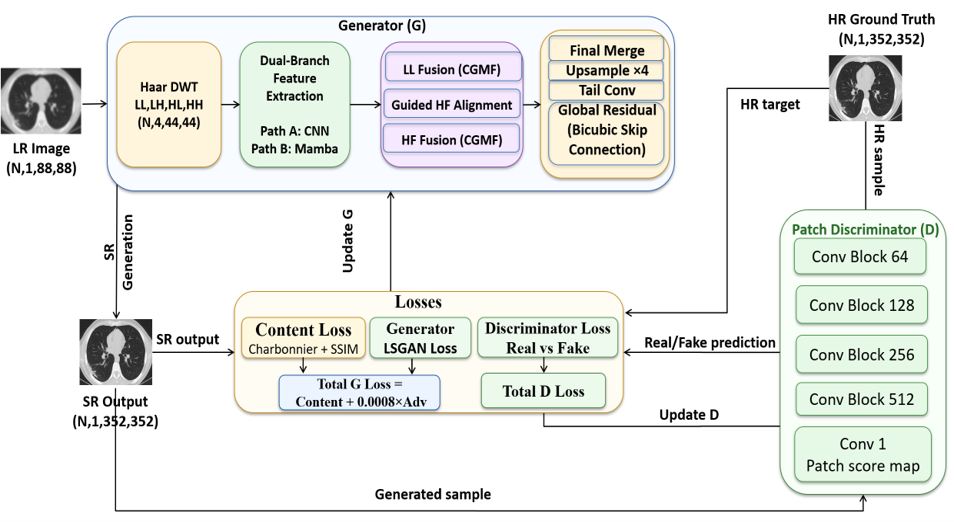

# CGMF-CT-SR

A frequency-aware dual-branch framework for **×4 single-channel CT image super-resolution**. The model combines band-wise CNN feature extraction with joint Mamba-based wavelet modeling, followed by **Confidence-Guided Max Fusion (CGMF)** and **LL-guided high-frequency feature alignment**.

The implementation accompanies the paper:

> **A Frequency-Aware Dual-Branch Framework with Confidence-Guided Max Fusion for CT Image Super-Resolution Balancing Reconstruction Fidelity and Perceptual Quality**

## Overview

The proposed generator first applies a fixed one-level Haar discrete wavelet transform to decompose each low-resolution CT image into four sub-bands: LL, LH, HL, and HH.

Two complementary feature-extraction paths are then used:

- **Path A — Band-wise CNN branch:** processes LL, LH, HL, and HH independently to learn local frequency-specific representations.
- **Path B — Joint Mamba branch:** jointly embeds the four wavelet sub-bands and models long-range spatial dependencies over the shared wavelet representation.

The extracted features are integrated using:

- **Confidence-Guided Max Fusion (CGMF)** for low- and high-frequency feature fusion.
- **LL-guided high-frequency alignment** for refining the Mamba-derived LH, HL, and HH features before fusion.
- **PixelShuffle-based reconstruction** with a global bicubic residual connection.

The full framework is trained using a weighted Charbonnier–SSIM content loss and a lightweight LSGAN adversarial objective.

## Architecture



Additional architecture diagrams are provided in the `figures/` directory, including the generator, CNN branch, Mamba block, and LL-guided alignment module.

## Main Experimental Results

The proposed model achieved the following average results on the MosMed-L test set:

| Metric | Result |
|---|---:|
| PSNR ↑ | 31.713 dB |
| SSIM ↑ | 0.924 |
| LPIPS ↓ | 0.0628 |
| DISTS ↓ | 0.0959 |

The test set contains 1,110 grayscale CT images generated from a patient-level split with no patient overlap among training, validation, and test subsets.

## Repository Structure

```text
CGMF-CT-SR/
├── README.md
├── requirements.txt
├── code-notebooks/
│   ├── CGMF_CT_SR_Training_and_Evaluation.ipynb
│   └── Statistical_Analysis.ipynb
├── figures/
│   ├── alignment_module.png
│   ├── cnn_branch.png
│   ├── convergence_behavior.png
│   ├── dists_forest_plot.png
│   ├── forest_plot_psnr.png
│   ├── generator.png
│   ├── lpips_forest_plot.png
│   ├── main_model.png
│   ├── mamba_block.png
│   ├── ssim_forest_plot.png
│   ├── test_sample1.png
│   ├── test_sample2.png
│   ├── test_sample3.png
│   └── training_loss_evaluation.png
├── pretrained-model/
│   └── README.md
└── results/
    ├── test-metrics.csv
    ├── train_loss_epoch.csv
    ├── val_metrics_epoch.csv
    └── statistics/
        ├── data_validation_report.csv
        ├── descriptive_statistics_full.csv
        ├── descriptive_statistics_publication.csv
        ├── image_matching_report.csv
        ├── master_paired_metrics.csv
        ├── table_friedman_full.csv
        └── table_wilcoxon_publication.csv
```

## Environment

The code was developed and tested with:

- Python 3.10
- PyTorch 2.11.0
- Torchvision 0.26.0
- CUDA 12.8
- Mamba-SSM 2.3.2.post1
- causal-conv1d 1.6.2.post1

The remaining dependencies are listed in `requirements.txt`.

## Installation

Create and activate a Python virtual environment:

```bash
python3 -m venv cgmf-ct-sr
source cgmf-ct-sr/bin/activate
python -m pip install --upgrade pip setuptools wheel ninja packaging
```

Install the CUDA 12.8 build of PyTorch and Torchvision:

```bash
python -m pip install \
  torch==2.11.0 \
  torchvision==0.26.0 \
  --index-url https://download.pytorch.org/whl/cu128
```

Install the Mamba dependencies after PyTorch:

```bash
python -m pip install causal-conv1d==1.6.2.post1 --no-build-isolation
python -m pip install mamba-ssm==2.3.2.post1 --no-build-isolation
```

Install the remaining packages:

```bash
python -m pip install -r requirements.txt
```

## Dataset Preparation

The experiments use the **MosMed-L** lung CT dataset.

The dataset is not included in this repository. Before running the notebooks:

1. Prepare patient-level training, validation, and test folders.
2. Resize the HR grayscale PNG images offline to `352 × 352`.
3. Keep all slices from the same patient in only one subset.
4. Update the dataset paths in the configuration cell of the training and evaluation notebook.

The adopted split is:

| Subset | Patients | Images |
|---|---:|---:|
| Training | 777 | 3,885 |
| Validation | 111 | 555 |
| Testing | 222 | 1,110 |

Low-resolution images are generated on-the-fly using bicubic downsampling by a factor of ×4, producing `88 × 88` inputs from `352 × 352` HR images.

## Training and Evaluation

Open:

```text
code-notebooks/CGMF_CT_SR_Training_and_Evaluation.ipynb
```

The notebook includes:

- dataset loading and on-the-fly LR generation;
- full model definition;
- generator and discriminator training;
- EMA-based validation;
- best-checkpoint selection using validation PSNR;
- test-set evaluation using PSNR, SSIM, LPIPS, and DISTS;
- CSV logging for training, validation, and testing.

Before execution, update the following paths in the configuration cell:

```python
train_dir = "/path/to/train"
val_dir = "/path/to/validation"
test_dir = "/path/to/test"
save_dir = "/path/to/output"
```

The principal training settings are:

| Parameter | Value |
|---|---:|
| Scale factor | ×4 |
| LR size | 88 × 88 |
| HR size | 352 × 352 |
| Batch size | 8 |
| Epochs | 30 |
| Generator learning rate | 2 × 10⁻⁴ |
| Discriminator learning rate | 1 × 10⁻⁴ |
| Adam β₁, β₂ | 0.5, 0.999 |
| EMA decay | 0.999 |
| Adversarial weight | 0.0008 |
| Random seed | 123 |

## Pretrained Model

The pretrained checkpoint corresponds to the model selected by the best validation PSNR using EMA weights.

Because the checkpoint is larger than GitHub's regular file-size limit, it should be provided through a **GitHub Release** or another external archival service.

Add the download URL to:

```text
pre-trained model/README.md
```

Expected checkpoint name:

```text
best.pt
```

## Statistical Analysis

Open:

```text
code-notebooks/Statistical_Analysis.ipynb
```

The notebook reproduces the statistical analysis reported in the paper, including:

- validation of image-name matching across model result files;
- descriptive statistics;
- Friedman tests;
- Kendall's W effect sizes;
- pairwise Wilcoxon signed-rank tests;
- Holm correction for 24 pairwise comparisons;
- paired median differences;
- BCa 95% bootstrap confidence intervals;
- forest plots for PSNR, SSIM, LPIPS, and DISTS.

The associated CSV outputs are available in:

```text
results/statistics/
```

## Output Files

- `results/train_loss_epoch.csv`: epoch-level generator, content, discriminator, and adversarial losses.
- `results/val_metrics_epoch.csv`: validation PSNR and SSIM for each epoch.
- `results/test-metrics.csv`: per-image test metrics for the proposed model.
- `results/statistics/master_paired_metrics.csv`: paired per-image metrics used in the statistical analysis.
- `results/statistics/table_friedman_full.csv`: Friedman-test and Kendall's W results.
- `results/statistics/table_wilcoxon_publication.csv`: Wilcoxon results with Holm correction.

## Notes

- The implementation is designed for single-channel grayscale CT images.
- The default model performs ×4 super-resolution from `88 × 88` to `352 × 352`.
- The Haar transform is fixed and implemented directly in PyTorch.
- LPIPS and DISTS require metric-specific channel and normalization handling, implemented in the evaluation notebook.
- The repository does not include the full MosMed-L dataset.


  year    = {2026},
  note    = {Manuscript}
}
```

## Contact

For questions related to the implementation or experimental protocol:

**Sudad Najim Abed**
